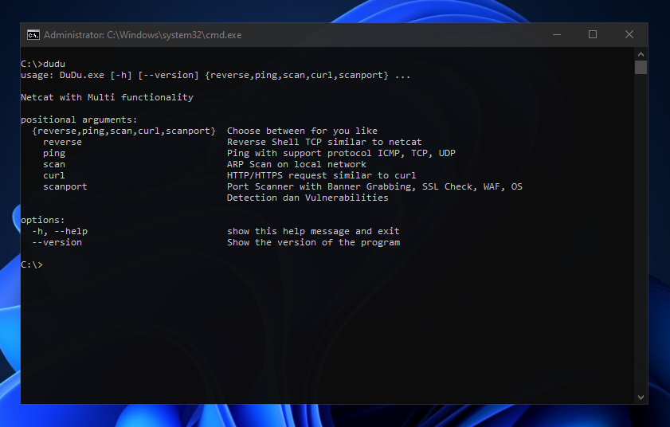

## Dudu Network Tools
Dudu is a versatile networking tool inspired by netcat, designed to streamline network diagnostics and security assessments. This program offers a range of features to facilitate system administration and penetration testing tasks. Designed to be lightweight and efficient, making it an essential tool for system administrators, ethical hackers, and security professionals. Its simple command-line interface allows for quick execution of powerful networking and security tasks, all in one place, including:

- Reverse Shell: Establish remote shell connections securely.
- Ping: Test network latency and connectivity.
- Host Scan: Discover live hosts in a network.
- cURL: Retrieve web resources and perform basic HTTP requests.
- Port Scan: Identify open ports on a target system.
- Vulnerability Check: Analyze potential security vulnerabilities.

Dudu is an all-in-one solution for network troubleshooting, security auditing, and more.

<h3>Key Features:</h3>

- Supports multiple platforms (add your supported platforms like Windows, Linux, etc.)
- Easy to integrate into existing scripts or automated workflows
- Highly customizable with optional arguments for tailored operations

<h4>Requirement Module:</h4>
- Scapy (Packet Manipulation)

```
pip install scapy
```


  

<h3>Usage Example:</h3>

```
dudu reverse -p <port>
```
```
dudu ping --host <target_ip>
```
```
dudu scan --target <network_range>
```
```
dudu curl <url>
```
```
dudu scanport -t <target_ip>
```
```
dudu --vuln-check <target_ip>
```
